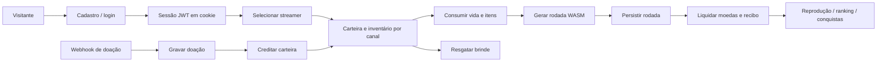

# Avaliação de escala — LiveXGames

**Parecer: NÃO APROVADO para mais de 1.000 usuários simultâneos.**

Avaliação em 14/09/2026, commit `98b7ee6`. O fluxo normal tem cobertura funcional, mas há falhas reproduzidas de recuperação de dados e requisitos ausentes para operar várias instâncias. Aprovação de testes funcionais não constitui medição de capacidade.

## Fluxo avaliado

Os intervalos **F → H** e **M → N** permitem perda persistente de direitos do usuário em caso de falha. Foram exercitados em PostgreSQL local descartável, sem modificar dados de produção.

| Parte do fluxo | Avaliação |
| --- | --- |
| Cadastro, login e navegação | Testes funcionais passaram; tokens emitidos não possuem revogação antecipada |
| OAuth Twitch/Kick | Estado normalmente compartilhado no PostgreSQL; falha de gravação ainda permite fallback local |
| Separação de moedas e inventário por canal | Validada em testes de integração |
| Compra e resgate de brindes | Débito/estoque com transações e testes concorrentes; bom ponto de partida |
| Abertura da rodada | Bloqueada por consumo anterior ao registro persistente |
| Liquidação de rodada já salva | Transacional, com recibo idempotente; testes passaram |
| Recebimento da doação | Bloqueado por registro e crédito não atômicos |
| Chat, saldo e eventos ao vivo | Falta compartilhamento de eventos entre instâncias |
| Notificações e conquistas | Central básica validada; envio Web Push e quatro conquistas de streamer incompletos |
| Deploy e operação | Readiness, recuperação, monitoramento e capacidade ainda precisam de validação |

## Bloqueios prioritários

### P0 — Doação concluída sem crédito recuperável

Em `backend/src/services/livepixService.js:242`, a doação é gravada antes de `creditFromDonation` (linha 271). Uma nova tentativa retorna antecipadamente ao encontrar `external_id` (linha 165).

**Reprodução:** injetei uma falha na chamada de crédito após a gravação. Na reentrega, o serviço retornou `idempotent: true`; o banco continha `status: completed` e `coins_credited: 1000`, mas o saldo continuava **0**, quando deveria ser **1.000**.

**Para liberar:** gravar doação, saldo e extrato na mesma transação, ou usar estado persistente pendente com recuperação idempotente. Testar reentrega concorrente e falhas em cada ponto entre gravações. Nunca marcar como concluído um crédito que não ocorreu.

### P0 — Queda durante abertura perde vida e item

`backend/src/services/gameRunService.js:115` consome vida e a linha 124 reserva itens. A geração ocorre na linha 146 e a gravação de `game_runs` apenas na linha 161. O `catch` pode compensar exceções, mas não executa quando o processo termina.

**Reprodução:** encerrei somente um processo filho de teste no começo da geração. Resultado persistido: vidas **3 → 2**, item **1 → 0**, **nenhuma rodada gravada**. Não há registro que permita a recuperação normal dessa abertura.

**Para liberar:** reservar recursos e registrar a intenção de rodada atomicamente; geração fora da transação longa; liquidação ou compensação recuperável após reinício. Incluir chave idempotente para repetição do mesmo pedido.

### P1 — Eventos não atravessam instâncias

`backend/src/server.js:86` cria Socket.IO sem adaptador compartilhado. Salas e `io.emit` pertencem ao processo local. Um webhook recebido no servidor A não avisa clientes conectados ao B. O chat em `server.js:809` aceita mensagens sem limite por socket e retransmite globalmente; eventos de partidas também são globais.

**Para liberar:** configurar adaptador compartilhado, definir a política de transporte/afinidade e validar cliente em A recebendo evento originado em B. Limitar mensagens e restringir broadcasts ao público necessário. A documentação oficial descreve tanto o encaminhamento entre servidores quanto o tratamento de sessões para long-polling. [Socket.IO: múltiplos servidores](https://socket.io/docs/v4/using-multiple-nodes/).

### P1 — Readiness e publicação não comprovadas

`backend/src/config/database.js:81` marca conexão disponível antes das migrações; falha de migração é capturada e apenas registrada na linha 94. `/health` usa esse booleano, permitindo serviço considerado saudável com schema incompleto. O servidor também não possui rotina explícita para terminar requisições e workers antes de sair.

O site público respondeu **200** em `/` e `/health`. O `app.js` público foi baixado e seu hash calculado: **4385fc4470**, igual ao arquivo do commit `98b7ee6`, enquanto o CI desse commit ainda executava. Isso exige conferir o gate no painel do Render; o hash confirma o asset, não identifica sozinho todo o commit implantado no backend.

**Para liberar:** readiness condicionada a schema pronto, encerramento controlado, teste de deploy sob tráfego e confirmação do gate efetivo e do commit publicado. Migrações devem rodar de forma serializada, evitando que instâncias novas apliquem o mesmo arquivo simultaneamente.

### P1 — Infraestrutura e capacidade sem comprovação

`render.yaml:6` declara `plan: free`. Não consultei o plano efetivo no painel. Na modalidade gratuita, Render não permite escalar além de uma instância e pode suspender o serviço após inatividade; a própria documentação não recomenda essa modalidade para produção. [Limites do Render Free](https://render.com/docs/free).

O pool PostgreSQL tem **10 conexões por processo** (`database.js:57`); isso não representa um limite de dez usuários, mas exige orçamento de conexões ao multiplicar instâncias. A fila de simulação não possui teto nem prazo durante a espera: o timeout de dez segundos começa apenas ao despachar para um worker (`runVerifier.js:27,78,109`). Não há prova de saturação em 1.000 usuários, mas falta proteção previsível contra sobrecarga.

Consultas de conquistas percorrem o histórico a cada rodada. Com 1.500 clientes no mesmo jogo, o recarregamento do ranking a cada cinco segundos pode produzir aproximadamente **300 requisições/s**, se continuamente acionado; essa é uma estimativa de cenário, não tráfego medido. Medir planos SQL e custo com volume de histórico representativo antes de decidir cache ou contadores incrementais.

**Para liberar:** ambiente de homologação com recursos equivalentes à produção, plano que permita a disponibilidade desejada, orçamento de banco/conexões, limite de fila e rejeição controlada em sobrecarga. Dimensionar depois de medir. [Escala no Render](https://render.com/docs/scaling).

### P1 — Operação e recuperação

Não encontrei métricas de latência/erros/fila/pool, alertas ou procedimento testado de backup e restauração no repositório. O README também registra essas pendências. Isso não prova ausência de backup no provedor; sua configuração e restauração precisam ser demonstradas.

Tokens JWT são aceitos sem consulta de revogação (`backend/src/middlewares/auth.js:32`); logout e alteração de senha não invalidam antecipadamente tokens já emitidos, conforme a pendência documentada.

**Para liberar:** alertas para erros, latência, conexões, fila e divergência de carteira; teste de restauração com RPO/RTO definidos pelo negócio; revogação de sessão para logout/troca de senha; verificação das integrações reais de e-mail/OAuth/armazenamento. Web Push e conquistas faltantes devem ser concluídos ou explicitamente retirados do escopo de lançamento.

## Evidências executadas

- Na validação do mesmo commit: **211 testes backend**, **65 E2E**, integração PostgreSQL, lint, TypeScript, formatação e verificação dos jogos passaram localmente.
- Nesta avaliação: duas reproduções de falha com PostgreSQL 18 descartável; ambas confirmaram os bloqueios P0.
- Microbenchmark: **1.500 gerações WASM**, um worker, **336 ms** no total; latência p95 incluindo a espera local de **318 ms**. Node local **24.19.0**. Não inclui HTTP, banco, autenticação, sockets ou renderização e **não comprova capacidade de 1.500 usuários**. Não foi executado teste de carga no site público.
- Evidências locais em [scale-audit-evidence.json](artifacts/scale-audit-evidence.json); reprodução local em `scratch/scale-audit.cjs`. Essas pastas são ignoradas pelo Git; os resultados essenciais estão registrados neste documento. O script exige banco local com nome específico e injeta falhas intencionais.
- Código de produção não foi alterado nesta avaliação. A instância PostgreSQL de auditoria foi encerrada ao final.

## Critérios propostos para aprovação

1. Corrigir os dois P0 e passar cenários de crash, timeout e reentrega sem perda ou crédito duplicado.
2. Validar ao menos duas instâncias, incluindo eventos entre elas e reinício de uma durante partidas.
3. Em homologação, executar **1.500 sessões simultâneas por 60 minutos**, com identidades e canais distintos, WebSockets ativos, navegação, partidas, loja e resgates. A mistura de atividade deve refletir o uso esperado; uma sessão conectada não equivale a uma requisição por segundo.
4. Exercitar pico de **2× a carga definida**, medir fila e recuperação. Metas iniciais propostas: erros inesperados <0,5%, p95 de leitura <500 ms, p95 de abertura <2 s, sem crescimento contínuo de memória/fila e **zero divergência econômica**. Essas metas são critérios a testar, não resultados obtidos.
5. Demonstrar restauração de backup, alertas e implantação/reversão sob tráfego. Confirmar CI concluído e correspondência entre commit aprovado e serviço publicado.

Até essas evidências existirem, o projeto pode seguir em homologação e testes controlados; não há base para aprovar a meta de mais de 1.000 usuários simultâneos.
