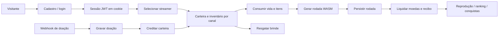

# Avaliação de escala — LiveXGames

**Parecer: NÃO APROVADO para mais de 1.000 usuários simultâneos.**

Avaliação em 14/09/2026, commit `98b7ee6`. O fluxo normal tem cobertura funcional, mas há falhas reproduzidas de recuperação de dados e requisitos ausentes para operar várias instâncias. Aprovação de testes funcionais não constitui medição de capacidade.

> **Atualização em 15/09/2026 — os bloqueios P0 foram corrigidos e validados no CI real (PostgreSQL).**
> Resolvidos: doação atômica (P0-A), abertura recuperável com intenção `reserving` e idempotência (P0-B, revisto em 17/09 — ver abaixo), revogação de sessão (`token_version`), Web Push ligado às conquistas, readiness honesta (`/health` 503 sem schema), encerramento controlado (SIGTERM/SIGINT) e deadlock 40P01 de liquidações concorrentes. Falta o P1-C (eventos entre instâncias) e a validação de carga e operação.

## Fluxo avaliado

Os intervalos **F → H** e **M → N** permitem perda persistente de direitos do usuário em caso de falha. Foram exercitados em PostgreSQL local descartável, sem modificar dados de produção.

| Parte do fluxo                             | Avaliação                                                                                      |
| ------------------------------------------ | ---------------------------------------------------------------------------------------------- |
| Cadastro, login e navegação                | Testes funcionais passaram; tokens emitidos não possuem revogação antecipada                   |
| OAuth Twitch/Kick                          | Estado normalmente compartilhado no PostgreSQL; falha de gravação ainda permite fallback local |
| Separação de moedas e inventário por canal | Validada em testes de integração                                                               |
| Compra e resgate de brindes                | Débito/estoque com transações e testes concorrentes; bom ponto de partida                      |
| Abertura da rodada                         | Bloqueada por consumo anterior ao registro persistente                                         |
| Liquidação de rodada já salva              | Transacional, com recibo idempotente; testes passaram                                          |
| Recebimento da doação                      | Bloqueado por registro e crédito não atômicos                                                  |
| Chat, saldo e eventos ao vivo              | Falta compartilhamento de eventos entre instâncias                                             |
| Notificações e conquistas                  | Central básica validada; envio Web Push e quatro conquistas de streamer incompletos            |
| Deploy e operação                          | Readiness, recuperação, monitoramento e capacidade ainda precisam de validação                 |

## Bloqueios prioritários

### P0 — Doação concluída sem crédito recuperável

**✅ RESOLVIDO em 15/09/2026 (migração 027 + commit `26cc53c`).** Em `backend/src/services/livepixService.js`, a doação, o saldo e o extrato agora são gravados na mesma transação (crédito atômico) com `external_id` único; a reentrega é idempotente e nunca marca como concluído um crédito que não ocorreu. No PostgreSQL do CI, `webhook.test.js` cobre crédito e reentrega sequencial; reentrega paralela e reconciliação (`donationAtomic.test.js`) só são testadas em memória (revisão de 17/09/2026 — pendência na Fase 6 de [AUDITORIA.md](AUDITORIA.md)).

### P0 — Queda durante abertura perde vida e item

**✅ RESOLVIDO em 17/09/2026 (Fase 1 do plano em [AUDITORIA.md](AUDITORIA.md)).** A versão de 15/09 (migração 028) ainda falhava em dois pontos, ambos reproduzidos no PostgreSQL: a vida e os itens eram debitados fora da transação da intenção (um clique duplo destruía o item), e as intenções órfãs eram estornadas a quem abrisse a próxima rodada, não ao dono. Agora `GameRunService.reservar` grava vida, itens e intenção numa única transação com lock consultivo por usuário; `abandonarEEstornar` devolve uma única vez e sempre ao dono; `recuperarOrfas` roda no boot, a cada minuto e na abertura do próprio usuário; o cliente envia `requestId`, e repetir o pedido devolve a mesma rodada sem novo débito. Coberto por `gameRunIntention.test.js` no PostgreSQL do CI.

### P1 — Eventos não atravessam instâncias

**⚠️ PRÓXIMO PASSO (P1-C).** `backend/src/server.js` cria Socket.IO sem adaptador compartilhado. Salas e `io.emit` pertencem ao processo local. Um webhook recebido no servidor A não avisa clientes conectados ao B. O chat já tem limite por socket (5 msg/10s) e broadcasts restritos à `stream_room` (feito em 15/09).

**Para liberar:** configurar adaptador compartilhado (`@socket.io/postgres-adapter`, já instalado, opt-in via `SOCKET_ADAPTER=postgres`, sem Redis), definir a política de transporte/afinidade e validar cliente em A recebendo evento originado em B. A documentação oficial descreve tanto o encaminhamento entre servidores quanto o tratamento de sessões para long-polling. [Socket.IO: múltiplos servidores](https://socket.io/docs/v4/using-multiple-nodes/).

### P1 — Readiness e publicação não comprovadas

**✅ RESOLVIDO em 15/09/2026 (commits `5892479`, `59a89d3`).** `database.js` agora só marca `isSchemaReady` após o autoMigrate concluir; `/health` responde **503 degraded** enquanto o schema não está pronto; o servidor tem encerramento controlado (SIGTERM/SIGINT: drena conexões, fecha Socket.IO e encerra workers), e as migrações rodam serializadas com advisory lock (`pg_try_advisory_lock`, esperando a vez em vez de pular). O CI roda com PostgreSQL real e passou por completo.

### P1 — Infraestrutura e capacidade sem comprovação

`render.yaml:6` declara `plan: free`. Não consultei o plano efetivo no painel. Na modalidade gratuita, Render não permite escalar além de uma instância e pode suspender o serviço após inatividade; a própria documentação não recomenda essa modalidade para produção. [Limites do Render Free](https://render.com/docs/free).

O pool PostgreSQL tem **10 conexões por processo** (`database.js:57`); isso não
representa um limite de dez usuários, mas exige orçamento de conexões ao multiplicar
instâncias. A fila de simulação agora tem **teto configurável**
(`SIM_VERIFIER_MAX_QUEUE`, default 50) com rejeição controlada
`VERIFIER_QUEUE_FULL` → 503 (feito em 15/09). O ranking usa **cache TTL 5s por
chave com invalidação** na liquidação (15/09), reduzindo as ~300 req/s estimadas.
Ainda não há prova de saturação em 1.000 usuários; falta teste de carga em
homologação.

Consultas de conquistas percorrem o histórico a cada rodada. Com 1.500 clientes no mesmo jogo, o recarregamento do ranking a cada cinco segundos pode produzir aproximadamente **300 requisições/s**, se continuamente acionado; essa é uma estimativa de cenário, não tráfego medido. Medir planos SQL e custo com volume de histórico representativo antes de decidir cache ou contadores incrementais.

**Para liberar:** ambiente de homologação com recursos equivalentes à produção, plano que permita a disponibilidade desejada, orçamento de banco/conexões, limite de fila e rejeição controlada em sobrecarga. Dimensionar depois de medir. [Escala no Render](https://render.com/docs/scaling).

### P1 — Operação e recuperação

Não encontrei métricas de latência/erros/fila/pool, alertas ou procedimento testado de backup e restauração no repositório. O README também registra essas pendências. Isso não prova ausência de backup no provedor; sua configuração e restauração precisam ser demonstradas.

**✅ RESOLVIDOS em 15/09:** revogação de sessão — tokens JWT carregam `tv` (token_version) e o `requireAuth` confere contra o banco; logout e troca de senha invalidam tokens emitidos antes (`747071e`). Web Push — `pushNotificationService` com VAPID opt-in; `sendToUser` sempre grava a notificação e só envia push se `VAPID_*` configurados; remoção de inscrições 410; ligado às conquistas (`d61d971`). Quatro conquistas de streamer continuam só no catálogo.

**Para liberar (restante):** alertas para erros, latência, conexões, fila e divergência de carteira; teste de restauração com RPO/RTO definidos pelo negócio; verificação das integrações reais de e-mail/OAuth/armazenamento.

## Evidências executadas

- Na validação do mesmo commit: **211 testes backend**, **65 E2E**, integração PostgreSQL, lint, TypeScript, formatação e verificação dos jogos passaram localmente.
- Nesta avaliação: duas reproduções de falha com PostgreSQL 18 descartável; ambas confirmaram os bloqueios P0.
- Microbenchmark: **1.500 gerações WASM**, um worker, **336 ms** no total; latência p95 incluindo a espera local de **318 ms**. Node local **24.19.0**. Não inclui HTTP, banco, autenticação, sockets ou renderização e **não comprova capacidade de 1.500 usuários**. Não foi executado teste de carga no site público.
- Evidências locais em [scale-audit-evidence.json](artifacts/scale-audit-evidence.json); reprodução local em `scratch/scale-audit.cjs`. Essas pastas são ignoradas pelo Git; os resultados essenciais estão registrados neste documento. O script exige banco local com nome específico e injeta falhas intencionais.
- Código de produção não foi alterado nesta avaliação. A instância PostgreSQL de auditoria foi encerrada ao final.

## Critérios propostos para aprovação

1. ~~Corrigir os dois P0 e passar cenários de crash, timeout e reentrega sem perda ou crédito duplicado.~~ **✅ Cumprido em 15/09/2026** (migrações 027/028 + testes de intenção/idempotência validados no CI com PostgreSQL real).
2. Validar ao menos duas instâncias, incluindo eventos entre elas e reinício de uma durante partidas. **⚠️ É o próximo passo (P1-C).**
3. Em homologação, executar **1.500 sessões simultâneas por 60 minutos**, com identidades e canais distintos, WebSockets ativos, navegação, partidas, loja e resgates. A mistura de atividade deve refletir o uso esperado; uma sessão conectada não equivale a uma requisição por segundo.
4. Exercitar pico de **2× a carga definida**, medir fila e recuperação. Metas iniciais propostas: erros inesperados <0,5%, p95 de leitura <500 ms, p95 de abertura <2 s, sem crescimento contínuo de memória/fila e **zero divergência econômica**. Essas metas são critérios a testar, não resultados obtidos.
5. Demonstrar restauração de backup, alertas e implantação/reversão sob tráfego. Confirmar CI concluído e correspondência entre commit aprovado e serviço publicado.

## Próximo passo — Sessão seguinte (16/09/2026)

**P1-C: eventos entre instâncias via `@socket.io/postgres-adapter`.**

- Já instalado `@socket.io/postgres-adapter`; código de ativação existe em `server.js` (opt-in `SOCKET_ADAPTER=postgres`).
- Fazer: subir 2 instâncias localmente (portas diferentes) com `SOCKET_ADAPTER=postgres`, validar chat/eventos atravessando A→B, testar reinício de uma instância durante partidas, definir política de long-polling (sticky sessions no Render).
- Depois: teste de carga em homologação (1.500 sessões) e alertas/backup.
- Padrão de trabalho: rodar `npm --prefix backend test` + lint + typecheck antes de cada commit; commits por fase; `gh run watch`; nunca empilhar sobre CI aberto.
- Lições do Postgres no CI: testes que criam dados como 1ª ação usam o pool assíncrono — `await db.whenReady()` antes (senão create cai no InMemory e `findById` devolve null → 404); liquidações concorrentes do mesmo usuário exigem `pg_advisory_xact_lock(hashtext(userId))` na transação (senão deadlock 40P01). Reprodução local: container `lxg_pg15` (postgres:15, porta 5433, senha `postgres`, bancos `stream_gamification_test` e `livex_channel_test`).

Até essas evidências existirem, o projeto pode seguir em homologação e testes controlados; não há base para aprovar a meta de mais de 1.000 usuários simultâneos.
