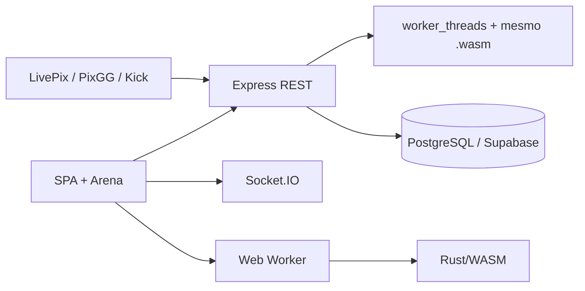

# LiveX Games

**IA ou desenvolvedor: leia [AGENTS.md](AGENTS.md) antes de trabalhar no projeto.**
Ele reúne as regras obrigatórias, validações, cuidados com dados e diagnóstico do CI.

Plataforma de gamificação para lives da Twitch e da Kick. O espectador escolhe o
canal de um streamer, joga na Arena, ganha moedas **daquele canal**, entra no
ranking e troca o saldo por brindes da lojinha do streamer. Moeda é fidelidade,
não dinheiro: não existe saque (zero cash-out, Lei nº 14.790/2023).

[Produção](https://livexgames.fun) · [API](https://livexgames.fun/docs) ·
[Status](https://livexgames.fun/status)

Este é o documento principal de produto, arquitetura, operação e pendências.
[ESCALA.md](ESCALA.md) registra a avaliação para mais de 1.000 usuários
simultâneos; [atualizacao.md](atualizacao.md) preserva a entrega visual e o ponto
de retomada. Revisado em 14/09/2026. Mudou uma regra? Atualize a seção aqui.

## Estado atual e retomada — 14/09/2026

**Não aprovado para escalar acima de 1.000 usuários simultâneos.** Há dois
bloqueios de integridade reproduzidos em PostgreSQL de teste: doação gravada
sem crédito recuperável e perda de vida/item se o processo cair antes de salvar
a rodada. Diagnóstico, evidências e critérios de aprovação em [ESCALA.md](ESCALA.md).

- Último commit enviado para `main`: **`98b7ee6`** — correções de conquistas,
  rankings, dashboard, inscrições push, visitante e relatórios do CI.
- Validação local desse código: **211 testes backend e 65 E2E passaram**;
  integração PostgreSQL, ESLint, TypeScript, Prettier e verificação dos jogos passaram.
- [CI 34860600309](https://github.com/ulisseskuster/LiveXGames/actions/runs/34860600309):
  backend, lint e jogos passaram; E2E ainda em execução na última consulta.
  Consultar novamente ao retomar; não presumir conclusão.
- Produção respondeu 200 em `/` e `/health`. O `app.js` público já tinha hash
  `4385fc4470`, igual ao enviado, enquanto o CI continuava em execução. Conferir
  o gate efetivo do Render; isso não identifica sozinho a versão de todo o backend.
- A auditoria de escala não alterou o código de produção. Os bloqueios abaixo
  foram **diagnosticados, não corrigidos**. A instância PostgreSQL de auditoria
  foi encerrada; os scripts locais estão em `scratch/` e as evidências em `artifacts/`.

**Próxima tarefa:** corrigir primeiro a atomicidade do webhook e a abertura
recuperável de rodada; depois preparar múltiplas instâncias, operação e teste
de carga em homologação. Não retomar trabalho visual como prioridade de escala.

## Quem usa

| Perfil                            | O que tem                                                                                                                                            |
| --------------------------------- | ---------------------------------------------------------------------------------------------------------------------------------------------------- |
| Visitante                         | Assiste à simulação local da Arena, sem gastar vida nem ganhar nada                                                                                  |
| Espectador                        | Até 3 vidas (+1 a cada 8 h, todas de volta após 24 h), moedas por canal, roleta diária e resgate de brindes                                          |
| Sub (Twitch ou Kick, não acumula) | +2 vidas douradas por dia (voltam à meia-noite de Brasília), +20% de pontos nas rodadas, +10% de moedas nas doações e pintura dourada nos três jogos |
| Streamer                          | 999 vidas, lojinha de brindes, roleta, mural e webhooks LivePix/PixGG do canal                                                                       |
| Admin                             | 999 vidas; modera brindes e candidaturas de streamer                                                                                                 |

## Economia por canal

Moedas, consumíveis e vidas extras pertencem ao par **usuário + streamer**. O que
se ganha no canal A nunca paga compra, rodada ou brinde no canal B.

| O quê                | Onde fica                                            |
| -------------------- | ---------------------------------------------------- |
| Saldo e vidas extras | `channel_wallets` (uma linha por usuário + streamer) |
| Extrato              | `channel_wallet_transactions`                        |
| Consumíveis          | `channel_inventory`                                  |
| Canal da rodada      | `game_runs.streamer_id`, gravado na abertura         |

- Loja (`/api/shop/wallet`, `/inventory`, `/purchase`), os três jogos e a roleta
  exigem `streamerId` de uma conta streamer/admin e recusam antes de cobrar.
- Doação Pix (LivePix/PixGG): 1 BRL = 100 moedas (`COINS_PER_BRL`), webhook com
  HMAC SHA-256 e idempotência por `external_id`.
- Roleta diária: um giro por usuário, canal e dia; o prêmio é moedas, vida extra
  ou item.
- Brindes físicos e digitais passam por moderação do admin. O resgate debita o
  canal **dono do brinde**, na mesma transação do estoque e do pedido.
- A vida extra do canal é gasta antes das vidas normais.
- A migration 023 zerou uma única vez carteiras, extratos, ranking e partidas
  encerradas. Não há bônus de boas-vindas: conta nova começa com 0.
- Legado: a tabela `wallets` global ainda é lida pelo sandbox e por
  `/api/auth/me`.

## Rodadas da Arena

**Decisão do proprietário (13/09/2026):** a rodada é sorteada e paga no servidor
no clique em começar. O navegador só reproduz um filme de 15 a 20 s, que pode
ser pulado. Teclado, fechar a aba ou dados falsos não mudam o resultado. **Não
reintroduzir pilotagem interativa.**

1. `POST /api/game/runs` (`gameId`, itens, `streamerId`): gasta a vida extra do
   canal (ou uma vida normal/dourada), reserva os consumíveis do canal, gera a
   rodada inteira no worker WASM e liquida moedas, ranking e recibo numa
   transação antes de responder.
2. `GET /api/game/runs/:id/reveal`: só leitura (semente, nonce, loadout, replay e
   resultado).
3. O navegador reproduz o log com `SimHost`; **Ver resultado** pula a reprodução.
4. `POST /api/game/runs/:id/finish`: devolve o recibo salvo, sem pagar de novo. O
   canal creditado é `game_runs.streamer_id`, nunca o enviado pelo cliente.
5. Se o reveal ou o finish falhar, o `runId` fica em `sessionStorage` (usuário +
   canal + jogo) e o próximo clique retoma a mesma rodada sem gastar outra vida.
   404, 409 e 410 descartam a chave.

- **Sorteio:** semente = HMAC-SHA256 com chave derivada do `JWT_SECRET` (rótulo
  `livex:rodadas:v1`) sobre `usuário:jogo:nonce`. Em
  `games/sim/src/engine/roteiro.rs` ela define a duração (15–20 s), um fator
  triangular em [0,55; 1,45] e a distância = referência do jogo × fator. Pontos
  base = 2 × distância. Batida só encena, nunca encerra a rodada.
- **Ranking:** por jogo e período, `GET /api/leaderboard/{weekly|monthly|all}?gameId=`
  (7 dias, 30 dias ou desde o início).
- Rodadas geradas e não entregues são recuperadas antes da próxima abertura, sem
  novo sorteio.

Contrato central: `backend/src/services/gameRunService.js`,
`backend/src/services/sim/runVerifier.js`, `games/client/src/embed/main.ts`,
`games/client/src/shell/simHost.ts` e `games/client/src/shell/cinema.ts`.

### Os três jogos

| Jogo         | Identidade                                                  | Consumíveis à venda                                                 |
| ------------ | ----------------------------------------------------------- | ------------------------------------------------------------------- |
| Jet Launcher | Capitão Orion: caça entre prédios, anéis e combate aéreo    | Nitro Booster, Escudo Defletor, Tanque Extra                        |
| Neon Drifter | Luna Vex: esportivo em cidade noturna, chuva e perseguição  | Injeção de NOS, Pneus Radiais de Drift, Escudo de Pulso EMP         |
| Void Walker  | Zara e BOB: nave entre planetas, asteroides e singularidade | Salto Quântico, Escudo de Plasma Cósmico, Matéria Escura Propulsora |

O botão **Suprimentos** no cockpit abre a loja e o inventário do jogo. Até 3
itens por rodada; uma unidade de cada item equipado é consumida ao começar. A
Bateria de Vidas é a recarga universal, fora dessas lojas. Flares, Míssil EMP e
os cosméticos VIP saíram de venda, mas os registros ficam para não apagar
compras antigas. Os três títulos não podem virar a mesma corrida com skins.

### Pontos e moedas

- **Pontos:** cada consumível multiplica por `1 + min(100, preço × peso) / 100`
  (peso: comum 1; raro 1,5; épico 2; lendário 3), no máximo ×2 por item, com
  fatores multiplicativos. Sub soma ×1,2. Arredondamento em `scoreBonus.js`.
- **Moedas** (`backend/src/services/economy.js`): base = 45 × distância /
  referência (Jet 2800 m, Neon 1200 m, Void 1000 m), de 25 a 65. Cada consumível
  soma `floor(min(base, 65) × preço / 65)`, que nunca passa do preço. Sub não
  ganha moeda extra na rodada.
- Preços, pontos e moedas ficam congelados na abertura e aparecem no debrief.
- Mudou física ou roteiro: suba `SIM_VERSION`. Mudou a referência de distância de
  um jogo: mude junto em `economy.js`.

### Determinismo

O mesmo `.wasm` roda no navegador e no servidor. Para isso continuar valendo:

- Toda regra de jogo vive em `games/sim` (Rust). O TypeScript só lê estado e
  desenha.
- Tick fixo de 60 Hz e PRNG com semente (xoshiro256\*\*). Proibido relógio ou
  `Math.random` na simulação.
- Sem `relaxed-simd` no build, trigonometria pela crate `libm` e iteração só em
  coleções de ordem estável.
- `e2e/simFundacao.spec.js` confere o mesmo hash no Node e no Chromium.
- Não ativar COOP/COEP: quebraria o login OAuth por popup. Logo, nada de
  `SharedArrayBuffer`.

### Build dos jogos

A saída é commitada em `frontend/public/games/` porque o Render não tem Rust.

```powershell
$env:Path = "$env:USERPROFILE\.cargo\bin;$env:Path"   # cargo fora do PATH padrão
npm run games:build    # WASM + Vite + loader + manifesto
npm run assets:stamp
npm run games:check
```

- O job `games` do CI confere o hash das fontes e joga as mesmas partidas no
  `.wasm` publicado e num recém-compilado. Qualquer mudança em `games/sim/src` ou
  `games/client/src`, até de comentário, exige rodar o build.
- Não edite os bundles à mão nem use só `npm --prefix games/client run build`.
- Rode `cargo` dentro de `games/sim` e não rode build e `cargo test` ao mesmo
  tempo (mesmo `target/`).
- `/games/sandbox.html`, a página interativa da fundação, só existe fora de
  produção.

## Segunda atualização visual — entrega por etapas

A execução de `atualizacao.md` começou pela **etapa 1, apresentação**:

- Preparação com veículo, tripulação, frase e tipografia por jogo; miniaturas
  reaproveitam os SVGs locais. O título do HUD aparece durante o filme, evitando
  duplicação na preparação.
- Galeria opcional com os três veículos, rolagem manual e acesso por teclado.
- Suprimentos com descrição curta do catálogo, arte e bônus existentes. Painel
  limitado à altura do cockpit, com fechamento fixo e conteúdo rolável.
- Resultado com entrada suave, identificação da tripulação, consumíveis usados
  no recibo e destaque de pontos/moedas. Respeita movimento reduzido e permite
  rolagem em telas baixas; não acrescenta espera para receber o resultado.
- URLs dos assets recarimbadas e cache PWA v19. Sem novos assets de produção,
  dependências, mudanças na simulação ou no manifesto de instalação.

Validação desta etapa: lint, TypeScript, `games:check`, formatação e cinco cenários
Playwright (`visualArena.spec.js` e `hudShop.spec.js`). Conferidos 320, 360, 390,
768 e 1440 px em Chrome, compra/equipamento/consumo, filmes completos com hash e
pontuação oficiais preservados, WebGL2 e renderer automático com movimento
reduzido. Capturas regeneráveis por `e2e/visualArena.spec.js` e `e2e/hudShop.spec.js`.

**Etapa 2 entregue — Neon Drifter:** passagem coberta em quadras fixas, prédios
baixos contínuos, pilares, placas de entrada, luzes de emergência suaves e
reflexos reforçados no asfalto. A intensidade ambiente acompanha a entrada/saída;
movimento reduzido mantém as luzes estáticas. Tudo deriva da distância já presente
no replay. TypeScript, build e três cenários de navegador (replay/teclado/pulo,
filme completo responsivo e renderer automático/reduzido) validados; WASM v3
inalterado. Cache PWA v20.

**Etapa 3 entregue — Void Walker:** disco com distorção local em TSL e arcos
finos, aproximação no clímax, entorno mais escuro e inclinação dos rastros
decorativos. Sem passe adicional de pós-processamento. O modo reduzido desliga
pulso, distorção animada e deslocamento extra. TypeScript, build e três cenários
de navegador passaram, incluindo WebGL2, renderer automático e recibo preservado.
Cache PWA v21; simulação e trajetórias permanecem intactas.

**Próxima entrega: etapa 4, céu/drones/escudo do Jet Launcher.** Depois seguem
singularidade do Void, céu/drones/escudo do Jet e medição. Comparação 30/60 fps e
testes em aparelhos físicos continuam pendentes; esta etapa valida apresentação
e funcionamento, não certifica desempenho nesses aparelhos. O checklist de
retomada está no início de `atualizacao.md`.

## Primeira atualização visual dos jogos — 14/09/2026

**Status: implementada e enviada para `main` no commit `889c744`.** Os três jogos
receberam modelos originais, materiais e iluminação próprios, HUDs reorganizados,
arte para suprimentos e resultado. O filme continua com 15–20 s; sorteio,
liquidação, consumíveis, bônus de sub e economia continuam no servidor. A
publicação em produção depende da execução do CI e da regra de deploy do Render.

Base da avaliação: leitura do README e das cenas, HUDs e ciclo de reprodução;
inspeção das capturas desktop e mobile (regeneráveis pelos testes visuais do
Playwright). O navegador conectado estava indisponível na avaliação inicial. Na
implementação, o Playwright executou o build local e gerou novas capturas,
revisadas em início, meio e fim de rodada, além dos layouts de 320, 360, 390,
768 e 1440 px.

### Entrega realizada

- **Jet:** ORION-07 com fuselagem contínua, asas enflechadas, canopy e dois
  motores; cidade com fachadas estruturadas e terraços; céu de amanhecer sem a
  grade do chão. HUD periférico, barra de reprodução e avisos sem duplicação.
- **Neon:** VEX-01 com carroceria própria, para-lamas, rodas completas e difusor;
  letreiros, asfalto de rugosidade variável, reflexos suaves e spray dos pneus.
- **Void:** explorador modular ARK-03, BOB visível, giroscópio contido, planetas
  com texturas esféricas procedurais, atmosfera e disco de acreção. Câmera
  adaptada ao retrato mantém a nave dentro da tela.
- **Interface:** preparação com explicação da rodada automática; nove
  ilustrações de suprimentos; fechamento da loja fixo durante a rolagem; resultado
  com arte por jogo e indicação do canal. Paletas de areia, rosa e azul pálido.
- **Áudio:** timbres próprios para turbina, esportivo e nave; efeitos ligados
  aos estados do replay, respeitando o mudo do site.
- **Recursos:** modelos, texturas e SVGs são arte original criada no projeto,
  sem licenças ou downloads de terceiros. Utilitários em `shell/arte.ts`, modelo
  do carro em `neon_drifter/modelo.ts`, SVGs em `frontend/public/images/`.
  Geometrias, materiais, mapas e observadores são liberados ao desmontar a cena.

Validação: lint e TypeScript; 188 testes do backend em memória; 16 testes Rust;
14 cenários de navegador entre jogos, HUD, economia por canal, determinismo e
`e2e/visualArena.spec.js`. Cobertura inclui filme completo e pulo, teclado sem
controle sobre resultado, recuperação de reveal, loja estreita, pintura dourada,
movimento reduzido, WebGL2 forçado e caminho automático do renderer. A simulação
continua na versão 3, sem mudança de fontes Rust ou de backend nesta atualização.

`npm run games:build`, `npm run assets:stamp` e `npm run games:check` geram e
verificam a saída publicada junto do código; cache PWA atualizado para v18.
O bundle de entrada dos jogos fica em aproximadamente 26,5 KB gzip e o módulo
compartilhado em 252,9 KB gzip, além do WASM e dos demais recursos. Texturas são
geradas localmente ao montar a cena. Metas de fps em celulares físicos ainda
precisam de medição nos aparelhos de referência; os testes de navegador não
certificam desempenho de produção.

A direção e os critérios abaixo registram o projeto e seus próximos incrementos. Trechos adicionais
de cenário (por exemplo, passagem coberta completa no Neon) e distorção da
singularidade podem ser evoluídos mantendo o mesmo contrato de reprodução.

### Como os jogos estão agora

| Jogo         | Experiência visual entregue                                                                                                                  |
| ------------ | -------------------------------------------------------------------------------------------------------------------------------------------- |
| Jet Launcher | ORION-07, um caça com fuselagem contínua, asas enflechadas, canopy e dois motores, voando entre uma cidade estruturada sob luz de amanhecer. |
| Neon Drifter | VEX-01, esportivo com carroceria, para-lamas, rodas, difusor, asfalto molhado, letreiros, chuva e spray de pneus.                            |
| Void Walker  | ARK-03, nave modular com BOB, giroscópio, planetas com superfície procedural e atmosfera, além do disco de acreção da singularidade.         |

O cockpit tem HUD compacto, mensagem explícita de rodada automática, suprimentos
com ilustrações próprias, resultado com a arte do jogo e layout responsivo. A
pintura dourada de assinante, o movimento reduzido, WebGL2 e o áudio específico
de cada título continuam funcionando. Cenas, câmera, partículas e som leem o
replay; não calculam ou alteram a partida.

Os quadros revisados ficam em `artifacts/atualizacao-visual/`, fora do
versionamento. Eles mostram preparação, loja em telas estreitas, começo, meio,
clímax e resultado. Esses arquivos são evidência de QA e podem ser regenerados
pelo teste visual (`e2e/visualArena.spec.js`), que recria a pasta.

### Proteção do contrato

“Inviolável” deve ser traduzido em um contrato verificável: **o jogador não
consegue alterar o resultado oficial pelo navegador**. O cliente pode ser
modificado pelo próprio usuário; a proteção está na autoridade do servidor,
não em impedir que alguém edite a tela. Esta atualização não certifica segurança
absoluta nem encerra as pendências de segurança listadas neste README.

- Cenas, modelos, câmera, partículas e áudio leem estados; não escrevem regras,
  pontos, distância, moedas, inventário ou canal de crédito.
- Não modificar o sorteio, a duração, os multiplicadores, os preços ou o consumo
  de itens para acomodar uma animação. Qualquer evolução futura do roteiro Rust
  exige escopo separado, testes determinísticos e atualização de `SIM_VERSION`.
- A decoração pode variar sem efeito econômico. Eventos de itens e seus bônus
  devem corresponder ao replay/loadout oficial, sem inventar coleta ou prêmio.
- Teclado, toque, gamepad, velocidade de renderização, “Ver resultado” e fechar
  a aba não alteram o recibo nem causam novo pagamento. Falha gráfica deve
  permitir consultar o resultado da rodada aberta, sem consumir outra vida.
- Preservar recuperação de rodada pendente, idempotência da liquidação e
  isolamento por usuário e canal. As lacunas já documentadas de idempotência da
  abertura e de persistência entre débito e geração merecem correção própria;
  uma reforma visual não as resolve.

### Verificação da atualização entregue

O código visual está concentrado nas cenas de `games/client/src`, nos HUDs, no
áudio e nos SVGs de `frontend/public/images/`. O backend e a crate Rust não foram
alterados. A saída foi gerada com `npm run games:build`, carimbada com
`npm run assets:stamp` e conferida com `npm run games:check`.

Foram executados lint, TypeScript, 188 testes do backend, 16 testes Rust e os
cenários Playwright dos três jogos. A verificação cobre pulo, teclado, WebGL2,
movimento reduzido, pintura dourada, responsividade, economia por canal e hash
oficial do replay.

## Mural de doações

Feed social das doações Pix no canal do streamer.

- 👍/👎: uma reação por usuário e doação, sem reagir na própria; clicar de novo
  remove.
- Ordenações: recentes, mais amadas, mais polêmicas e **maiores doadores**, em
  Sempre, Esta Semana ou Este Mês. Maiores doadores soma as doações concluídas
  por conta (ou pelo nome informado), deixa de fora as anônimas e não expõe ids.
- Tempo real por Socket.IO: doação nova entra no feed e contadores de reação
  atualizam para todos.
- O streamer oculta uma mensagem (`hidden_from_wall`; doação nunca é apagada) e
  pode desligar o mural do canal (`wall_enabled`).
- Rotas, todas sob `/api/streamer`: `GET /:streamerId/wall`,
  `GET /:streamerId/wall/top-donors`, `POST /:streamerId/wall/:donationId/react`
  e `DELETE /:streamerId/wall/:donationId`.
- Contadores em cache no banco só se a consulta do ranking passar de 200 ms em
  produção.

## Arquitetura



Node.js 22, Express, Socket.IO, PostgreSQL/Supabase com RLS, JWT em cookie
HttpOnly, CSP com nonce e Docker sem root. Frontend em JavaScript sem build,
servido pelo próprio Express; jogos em Three.js com WebGPU e fallback WebGL2.

```text
backend/src/        API, autenticação, economia, rodadas e webhooks
backend/test/       Node Test Runner (+ channelPostgres.integration.js)
frontend/public/    SPA (app.js, js/), estilos, PWA e bundles dos jogos
games/sim/          crate Rust: simulação determinística e testes
games/client/src/   Three.js, HUD, áudio e workers
database/           schema, seed e migrations
e2e/                Playwright
scripts/            build-games, check-games-build, stamp-assets e ícones
```

## Desenvolvimento

Pré-requisitos: Node.js 22+. Rust (versão fixada em
`games/sim/rust-toolchain.toml`, alvo `wasm32-unknown-unknown`) só para mexer nos
jogos; o `wasm-opt` vem do `binaryen` em `games/client`. PostgreSQL é opcional.

```powershell
npm install
npm install --prefix backend
npm install --prefix games/client
node backend/src/server.js      # http://localhost:3000
npm --prefix backend run dev    # com reinício automático
```

Copie `backend/.env.example` para `backend/.env` quando precisar de banco, OAuth,
e-mail ou webhooks. Sem `DATABASE_URL`, o backend usa o `InMemoryStore`. Nos
testes locais, defina `$env:DATABASE_URL=''`: o dotenv não sobrescreve variável
vazia, e isso impede de cair no banco do `.env`.

Banco: `node database/migrate.js`. No boot, o autoMigrate aplica cada arquivo de
`database/migrations` uma única vez (tabela `schema_migrations`, por nome).

```powershell
npm run lint
npm run format:check
npm run typecheck
npm run test:unit      # backend
npm run test:e2e       # Playwright
npm run games:test
npm run games:check
```

PostgreSQL real (o CI roda em Postgres 15): defina `TEST_DATABASE_URL` apontando
para localhost e um banco com prefixo `livex_channel_test`, depois rode
`node backend/test/channelPostgres.integration.js`.

## Deploy

- Render, serviço `livex-games` (`render.yaml`). Push em `main` publica. **Push só
  com autorização explícita.**
- `render.yaml` declara `autoDeployTrigger: checksPass`, e havia registro de
  ativação manual no painel. **O gate efetivo precisa ser reconfirmado:** na
  auditoria de 14/09/2026, o asset novo já era servido enquanto o CI do commit
  estava pendente. Conferir Settings → Build & Deploy → Auto-Deploy e o commit
  do deploy. Não afirmar que produção aguarda todos os checks sem essa evidência.
- O CI demora ~30 min: os testes E2E (64) rodam em runner lento e os pesados
  (visual/HUD/loja) usam timeouts ampliados via `process.env.CI` (ver
  `playwright.config.js` e `e2e/*.spec.js`). Local a suíte inteira leva ~3 min.
- `/health` responde 503 sem banco, para o Render não trocar a instância no ar
  por uma quebrada.
- Frontend novo: `npm run assets:stamp` e subir `CACHE_NAME` em
  `frontend/public/sw.js`.
- Bundles antigos de `frontend/public/games/` aparecem apagados quando o hash do
  Vite muda; isso é esperado junto dos novos.

Variáveis (lista completa em `backend/.env.example`; nunca publique o `.env`):

| Grupo                    | Variáveis                                                                                                                                                   |
| ------------------------ | ----------------------------------------------------------------------------------------------------------------------------------------------------------- |
| Obrigatórias em produção | `NODE_ENV=production`, `DATABASE_URL`, `JWT_SECRET`, `LIVEPIX_WEBHOOK_SECRET`, `PIXGG_WEBHOOK_SECRET`                                                       |
| Login                    | `TWITCH_CLIENT_ID`, `TWITCH_CLIENT_SECRET`, `TWITCH_REDIRECT_URI`, `TWITCH_AUTH_ENDPOINT`, `KICK_CLIENT_ID`, `KICK_CLIENT_SECRET`, `KICK_REDIRECT_URI`      |
| E-mail                   | `BREVO_API_KEY` ou `SMTP_HOST`, `SMTP_PORT`, `SMTP_USER`, `SMTP_PASS`; e `MAIL_FROM`                                                                        |
| Admin e links            | `ADMIN_PASSWORD` (conta `admin_livex`), `ADMIN_USERNAMES`, `PUBLIC_BASE_URL`                                                                                |
| Brindes                  | `CLOUDINARY_URL`: sem ela, criar brinde falha em produção                                                                                                   |
| Opcionais                | `TWITCH_BROADCASTER_ID` (sem ela, sub da Twitch nunca é reconhecido em produção), `COINS_PER_BRL`, `SIM_VERIFIER_WORKERS`, `DATABASE_SSL_CA`, `CORS_ORIGIN` |

Sem os três segredos obrigatórios o servidor não sobe; sem banco, `/health` dá 503.

## Regras que não podem regredir

- O cliente não define pontos, distância, moedas, itens usados nem o canal que
  recebe.
- A economia nunca atravessa canais.
- Não remover verificação do servidor para um teste passar.
- Toda string vinda do servidor passa por `escapeHtml()` antes de `innerHTML`.
- Nada de token em querystring nem credencial em código.
- Doação e outros registros financeiros não são apagados: são ocultados.
- Comentários em português, explicando o porquê.

## Pendências conhecidas

Levantadas nas auditorias de 12 e 13/09/2026 e conferidas no código em
14/09/2026. O que já foi corrigido saiu da lista.

**Segurança e operação**

1. Migração que falha não derruba o serviço: `checkConnection` só registra aviso
   (`backend/src/config/database.js`) e `/health` continua 200.
2. Sessão sem revogação: logout e troca de senha não invalidam o JWT já emitido
   (vale 24 h).
3. CSRF coberto só por `SameSite=Strict` e checagem de `Origin`, sem token.
4. Sem observabilidade: só `console.*`, sem request-id, métricas ou alertas.
5. Excluir um usuário apaga histórico financeiro: 18 `ON DELETE CASCADE` em
   `database/schema.sql`.
6. TLS do PostgreSQL sem validação de certificado, a menos que `DATABASE_SSL_CA`
   ou `DATABASE_SSL_REJECT_UNAUTHORIZED=true` estejam definidos.
7. O webhook da Kick não grava o `kick-event-message-id`. Reprocessar o evento
   hoje é inofensivo, mas não há deduplicação.
8. `frontend/public/tests.html` é restrito a admin e fica fora da imagem Docker,
   mas está desatualizado (compra sem `streamerId`).
9. Callbacks OAuth, `PUBLIC_BASE_URL` e o OpenAPI usam
   `livexgames.onrender.com`, não `livexgames.fun`.
10. Plano free do Render (cold start) e nenhuma rotina documentada de backup e
    restore.

**Rodadas**

11. Vida e itens são gastos antes de o worker gerar a rodada e de `game_runs` ser
    gravado (`gameRunService.js`). Uma queda nesse intervalo não tem recuperação
    persistente.
12. Se a resposta do `POST /api/game/runs` se perder, não há chave de
    idempotência.
13. A fila do verificador não tem limite (`backend/src/services/sim/runVerifier.js`).

**Bloqueios adicionais confirmados na auditoria de escala**

- **P0 — Doação:** `livepixService.js` grava a doação antes de creditar a
  carteira, fora de uma transação única. Falha de crédito seguida de reentrega
  retornou idempotência com saldo 0, embora a doação registrasse 1.000 moedas.
- **P0 — Abertura:** a pendência 11 foi reproduzida com encerramento de processo:
  vidas 3 → 2, item 1 → 0, nenhuma rodada persistida para recuperação.
- **P1 — Múltiplas instâncias:** Socket.IO sem adaptador compartilhado; broadcasts
  locais e globais sem limitação de mensagens por socket.
- **P1 — Capacidade/operação:** sem teste representativo de mais de 1.000 sessões,
  limite de fila, encerramento controlado, alertas ou restauração demonstrada.
  O plano declarado é gratuito; o plano real no painel não foi consultado.
- **Funcionalidade incompleta:** envio Web Push sem remetente/configuração de
  chave de aplicação; central sem criação automática de notificações nos eventos
  de produção; quatro conquistas de streamer só existem no catálogo.

**Frontend e código**

14. PWA: o fallback offline usa `ignoreSearch`, e o manifesto tem um único SVG em
    data URI para 192 e 512 px.
15. `frontend/public/app.js` monolítico (~5,4 mil linhas), com muitos
    `!important` e estilos inline.
16. No celular, o cabeçalho ocupa ~430 px e o pódio empilha 2º, 1º e 3º.
17. Todo model mantém dois caminhos, PostgreSQL e `InMemoryStore`.
18. Validação de entrada espalhada entre controllers e services.

## Planejamento da próxima atualização

**Prioridade atual: confiabilidade e escala**, conforme [ESCALA.md](ESCALA.md).
As etapas visuais 1–4 abaixo já foram entregues (histórico em `atualizacao.md`);
não implementá-las novamente. A medição em aparelhos reais continua pendente,
mas não substitui os testes de carga e recuperação do backend.

1. **Neon Drifter — passagem coberta:** criar um trecho fechado com placas,
   poças e luzes de emergência. O carro, a câmera e os eventos continuam lendo
   o mesmo replay; o trecho não cria colisões ou recompensas novas.
2. **Void Walker — singularidade:** adicionar distorção óptica leve ao disco de
   acreção e um momento de aproximação para o clímax. Manter uma alternativa
   simples para WebGL2 e movimento reduzido.
3. **Jet Launcher — céu e combate:** variar o horário entre amanhecer e alta
   atmosfera, dar leitura aos drones e criar um escudo translúcido sincronizado
   com os eventos já existentes.
4. **Apresentação:** melhorar a tela de preparação, galeria dos três veículos,
   transições do debrief e prévias dos consumíveis, sem aumentar o tempo da
   rodada.
5. **Medição:** medir 320, 390, 768 e 1440 px em aparelhos reais, comparar 30/60
   fps e o tamanho dos assets, ajustar apenas efeitos gráficos e atualizar o
   manifesto PWA.

Critério de aceite: a mesma semente, loadout, hash, distância, pontos, moedas,
vidas e canal devem produzir exatamente o mesmo recibo antes e depois. Qualquer
mudança em regra, física ou roteiro Rust deve ser tratada separadamente, com nova
`SIM_VERSION` e a bateria de determinismo.
